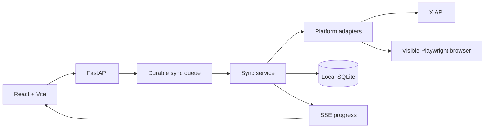

# CreatorPulse

> **See what is working across your creator accounts without living inside five dashboards.**
>
> A calm, local-first command center for account health, content performance, trends and comment triage.

[简体中文](README.zh-CN.md) | English

[](https://github.com/jiezeng2004-design/creator-pulse/actions/workflows/ci.yml)
[](LICENSE)
[](https://www.python.org/)
[](frontend/)
[](#local-first-by-design)

CreatorPulse brings the creator data you repeatedly check into one focused local workspace. It helps you answer simple questions faster:

- Which account needs attention?
- Which posts are actually performing?
- Are the metrics moving up or down?
- Which comments still need triage?
- Did the latest sync work, fail, or only partially succeed?

It runs on your machine, keeps platform credentials local, and leaves publishing and replying under your control.


## Why it exists

Creators who publish across several platforms usually end up doing the same loop every day:

```text
open platform A
   ↓
check posts and metrics
   ↓
open platform B
   ↓
check account state and comments
   ↓
repeat
```

CreatorPulse gives those read-heavy workflows one local surface:

```text
Accounts + posts + metrics + comments
                ↓
           CreatorPulse
                ↓
       one local dashboard
```

It is intentionally **not** an auto-posting bot or engagement automation system.

## What you get

- **Unified overview** for accounts, posts, comments and sync history.
- **Account health** that makes connection problems visible instead of silently failing.
- **Content performance** with available metrics normalized into one workspace.
- **Metric trends** instead of isolated snapshots where the platform exposes enough history.
- **Comment triage** for local inbox organization before you jump to the original platform to reply.
- **Clear sync states** with progress, cancellation and diagnostics.
- **Honest missing data**: unavailable fields stay unavailable instead of becoming misleading zeroes.
- **Demo mode** so you can explore the product without connecting a real account.

## See it in action

| Overview | Comment inbox | Account health |
| --- | --- | --- |
|  |  |  |

The screenshots use clearly labelled demo data. They do not contain real cookies, sessions, tokens or private creator analytics.

## Platform support

| Platform | Connection | Content / metrics | Comments | Status |
| --- | --- | --- | --- | --- |
| **Demo mode** | No account required | Complete sample workflow | Complete sample workflow | Stable |
| **X** | Official API Bearer Token or browser login | Public posts and available metrics | Permission-dependent | Stable with configured token |
| **Zhihu** | Manual login in local browser profile | Creator-center data where available | Experimental | Experimental |
| **Toutiao** | Manual login in local browser profile | Experimental creator-center reads | Experimental | Experimental |
| **Xiaohongshu** | Manual login in local browser profile | Experimental creator-center reads | Experimental | Experimental |

See [docs/platform-support.md](docs/platform-support.md) before relying on a platform-specific field.

## Quick start on Windows

### Requirements

- Python 3.12+
- Node.js 18+
- a Chromium-capable browser

### Start

Double-click:

```text
启动 CreatorPulse.bat
```

The launcher prepares local data directories, installs dependencies on first run, starts the backend/frontend services and opens:

```text
http://127.0.0.1:5174
```

Stop the background services with:

```text
停止 CreatorPulse.bat
```

### Try it without connecting an account

Open:

```text
设置 → 全局 Mock
```

Enable demo data, or add a demo account from the **账号** page.

That is the recommended first-run path because it lets you inspect the entire UI without sending credentials anywhere.

## Connect a real account

1. Open **账号** and choose a platform.
2. For browser-based connections, click **打开登录** and complete login manually in the visible local browser window.
3. Return to CreatorPulse and run **检查并同步**.
4. For X API mode, add the account username and configure the Bearer Token under **设置 → X API 配置**.

CreatorPulse does not automate CAPTCHA solving, bypass platform controls, publish content, delete content, like, follow, send private messages or silently reply to comments.

## Comment triage, not reply automation

The comment inbox is designed to help you organize attention locally.

A typical workflow is:

```text
sync comments
   ↓
filter / mark local state
   ↓
identify what needs a response
   ↓
open original platform
   ↓
reply there
```

This keeps high-impact account actions on the source platform instead of turning CreatorPulse into an opaque automation layer.

## Local-first by design

CreatorPulse keeps the control plane on your machine:

- backend binds to `127.0.0.1` by default;
- SQLite data stays under `data/`;
- browser sessions stay under `browser-profiles/`;
- X credentials stay in local configuration and are never returned by the API;
- logs and diagnostics redact Cookie, Authorization, Bearer and token/password-like values;
- runtime databases, browser profiles, `.env` files and tokens are excluded from the public repository.

Read [SECURITY.md](SECURITY.md) before reporting a security issue.

## Developer workflow

```powershell
.\scripts\setup.ps1
.\scripts\dev.ps1
.\scripts\test.ps1
```

Local endpoints:

| Service | URL |
| --- | --- |
| UI | `http://127.0.0.1:5174` |
| API | `http://127.0.0.1:8001` |
| OpenAPI | `http://127.0.0.1:8001/docs` |

## Architecture



The adapter layer normalizes platform-specific responses into shared account, post, comment, metric snapshot and sync-run models.

For implementation details, see [docs/architecture.md](docs/architecture.md).

## What CreatorPulse is not

- not an auto-posting platform;
- not a mass-reply bot;
- not a CAPTCHA bypass tool;
- not a cloud service that stores your creator sessions for you;
- not a promise that every platform exposes the same metrics;
- not a replacement for the original platform when you need to publish, reply or perform sensitive account actions.

## Roadmap

Current priorities:

- make the highest-value domestic-platform read paths more resilient;
- improve metric snapshots and trend comparisons where platforms expose enough data;
- make sync failures and partial results easier to diagnose;
- add safer import/export and backup workflows;
- keep every new integration explicit about what is stable, experimental or unavailable.

## Contributing

Bug reports, adapter observations, UI ideas and focused pull requests are welcome.

Start with [CONTRIBUTING.md](CONTRIBUTING.md). When reporting platform-specific issues, include redacted diagnostics and never attach cookies, browser profiles, local databases or tokens.

## License

MIT. See [LICENSE](LICENSE) and [THIRD_PARTY_NOTICES.md](THIRD_PARTY_NOTICES.md).

## Disclaimer

Use CreatorPulse only with accounts and data you are authorized to access. Platform pages, APIs, rate limits and terms can change. You are responsible for complying with applicable laws and platform rules.