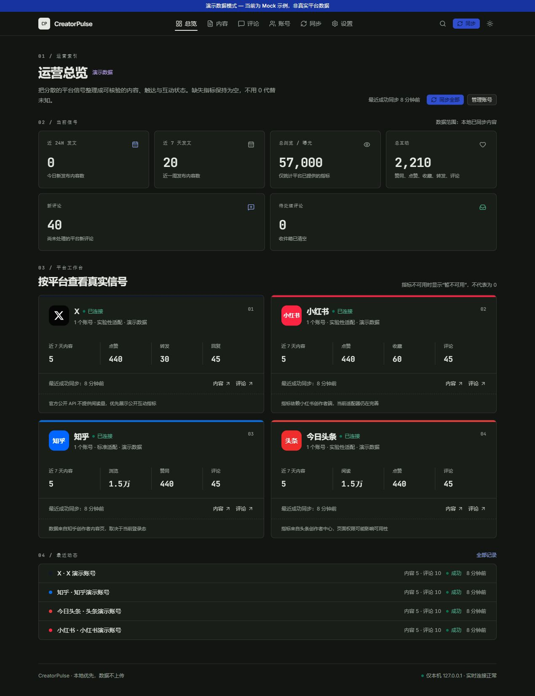
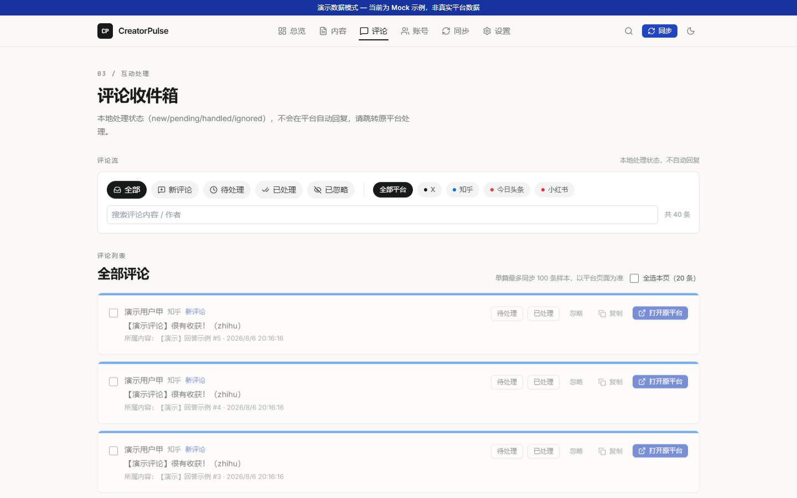
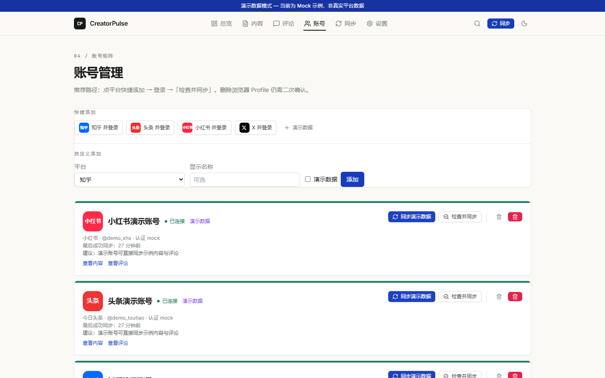
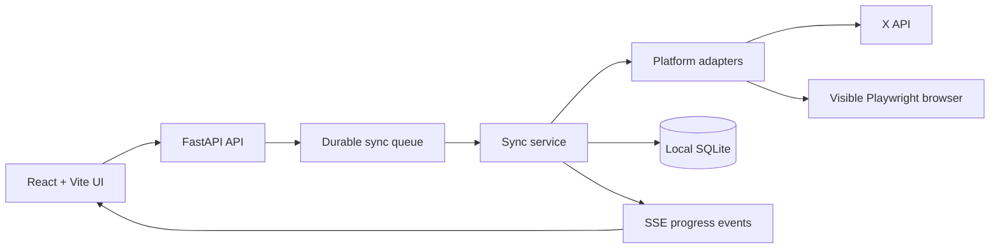

# CreatorPulse

> A calm, local-first command center for creators who publish everywhere.

[简体中文](README.zh-CN.md) | English

[](https://github.com/jiezeng2004-design/creator-pulse/actions/workflows/ci.yml)
[](LICENSE)
[](https://www.python.org/)
[](frontend/)
[](#security-by-default)

CreatorPulse brings account health, content performance, metric trends, and comment triage into one focused workspace. It runs on your machine, keeps platform credentials local, and leaves publishing and replying under your control.



## Why it feels different

- **One useful surface**: overview, posts, comments, accounts, and sync history share the same visual language.
- **Actionable status**: live sync phases, login next steps, cancellation, and clear failure diagnostics reduce guesswork.
- **Honest metrics**: unavailable platform fields stay unavailable instead of being shown as misleading zeroes.
- **Creator-friendly inbox**: filter and batch-process local comment states, then jump to the original platform to reply.
- **Demo mode included**: explore the complete UI without connecting an account or sending credentials anywhere.

## See it in action

| Overview | Comment inbox | Account health |
| --- | --- | --- |
|  |  |  |

The screenshots use clearly labelled local demo data. They do not contain real account sessions, cookies, tokens, or creator analytics.

## What is supported

| Platform | Connection | Content and metrics | Comments | Confidence |
| --- | --- | --- | --- | --- |
| **Demo mode** | No account needed | Complete sample workflow | Complete sample workflow | Stable |
| **X** | Official API Bearer Token or browser login | Public posts and available metrics | Permission-dependent | Stable with a configured token |
| **Zhihu** | Manual login in a local browser profile | Creator-center content and available metrics | Experimental, paginated | Experimental |
| **Toutiao** | Manual login in a local browser profile | Experimental creator-center reads | Experimental | Experimental |
| **Xiaohongshu** | Manual login in a local browser profile | Experimental creator-center reads | Experimental | Experimental |

Read the full [platform support matrix](docs/platform-support.md) before relying on a platform-specific field.

## Quick start on Windows

### 1. Install prerequisites

- Python **3.12+**
- Node.js **18+**
- A Chromium-capable browser (Playwright can install its own Chromium during setup)

### 2. Start the app

Double-click:

```text
启动 CreatorPulse.bat
```

The launcher creates local data directories, installs dependencies on first run, starts the FastAPI and Vite services, and opens `http://127.0.0.1:5174`.

To stop the background services, double-click:

```text
停止 CreatorPulse.bat
```

### 3. Explore safely

Open **设置 → 全局 Mock** and enable demo data, or add a demo account from **账号**. No platform login is required for the demo workflow.

### Developer commands

```powershell
.\scripts\setup.ps1   # first-time dependency setup
.\scripts\dev.ps1     # foreground development services
.\scripts\test.ps1    # backend and frontend checks
```

Local endpoints:

- UI: `http://127.0.0.1:5174`
- API: `http://127.0.0.1:8001`
- OpenAPI docs: `http://127.0.0.1:8001/docs`

## Connect real accounts

1. Open **账号** and choose a platform.
2. For Zhihu, Toutiao, Xiaohongshu, or browser-mode X, click **打开登录** and complete the login manually in the visible browser window.
3. Return to CreatorPulse and click **检查并同步**.
4. For X API mode, add your username and configure the Bearer Token in **设置 → X API 配置**.

CreatorPulse does not automate CAPTCHA solving, bypass platform controls, publish content, delete content, like, follow, send private messages, or reply to comments. Replying happens on the original platform after you choose to open it.

## Security by default

CreatorPulse is intentionally local-first:

- The backend binds to `127.0.0.1` by default.
- SQLite data stays under `data/`.
- Browser sessions stay under `browser-profiles/`.
- X credentials are stored locally in `backend/.env.x` and are never returned by the API.
- Logs and diagnostics redact Cookie, Authorization, Bearer, access-token, refresh-token, and password-like values.
- The public repository contains source, tests, docs, and demo screenshots only. It does not contain local databases, browser profiles, `.env` files, runtime logs, or tokens.

Please read [SECURITY.md](SECURITY.md) before opening a security report.

## Architecture



The adapter boundary normalizes platform-specific responses into shared account, post, comment, metric snapshot, and sync-run models. Browse [the architecture notes](docs/architecture.md) for concurrency, cancellation, retention, and extension rules.

## Repository map

```text
CreatorPulse/
├── backend/        FastAPI service, adapters, database models, tests
├── frontend/       React + TypeScript + Tailwind UI
├── docs/            API, architecture, platform support, adapter notes
├── scripts/         Windows setup, start, stop, dev, and test helpers
├── data/            Local SQLite data (ignored; created at runtime)
└── browser-profiles/ Local login sessions (ignored; created at runtime)
```

## Roadmap

- Make the most-used domestic-platform paths resilient to creator-center changes.
- Expand metric snapshots and trend comparisons where the platform exposes them.
- Add import/export helpers for creator-friendly backups and migrations.
- Keep every new platform capability read-only, local-first, and explicit about uncertainty.

## Contributing

Bug reports, adapter observations, UI ideas, and focused pull requests are welcome. Start with [CONTRIBUTING.md](CONTRIBUTING.md), include the platform and a redacted sync diagnostic when relevant, and never attach cookies, browser profiles, databases, or tokens.

## License

CreatorPulse is released under the [MIT License](LICENSE). See [THIRD_PARTY_NOTICES.md](THIRD_PARTY_NOTICES.md) for dependency and reference attribution.

## Disclaimer

Use this project only with accounts and data you are authorized to access. Platform pages, APIs, terms, and rate limits can change. You are responsible for complying with applicable laws and platform terms; the maintainers are not responsible for account restrictions or data loss.
